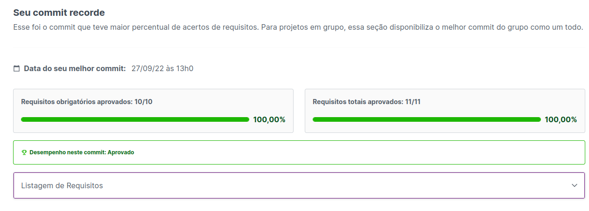

# Projeto One For All

Arquivo do banco de dados ```desafio1.sql```, rode o codigo dentro desse arquivo para criar o banco de dados.

Os arquivos ```desafio{2...N}.sql```, são as queries e de cada requisito.

### Nota do Projeto



<!-- Olá, Tryber!

Esse é apenas um arquivo inicial para o README do seu projeto.

É essencial que você preencha esse documento por conta própria, ok?

Não deixe de usar nossas dicas de escrita de README de projetos, e deixe sua criatividade brilhar!

⚠️ IMPORTANTE: você precisa deixar nítido:
- quais arquivos/pastas foram desenvolvidos por você; 
- quais arquivos/pastas foram desenvolvidos por outra pessoa estudante;
- quais arquivos/pastas foram desenvolvidos pela Trybe.

-->
